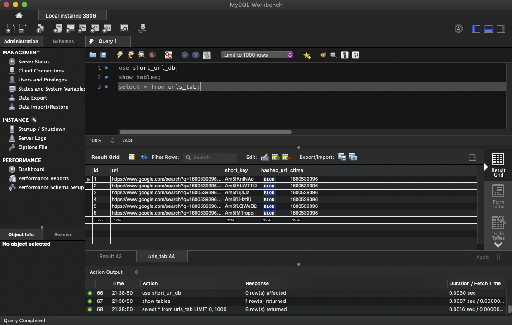
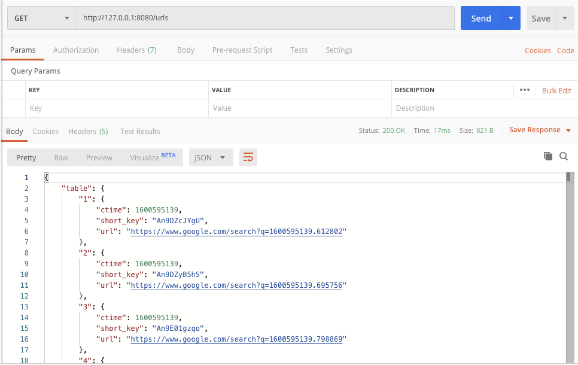
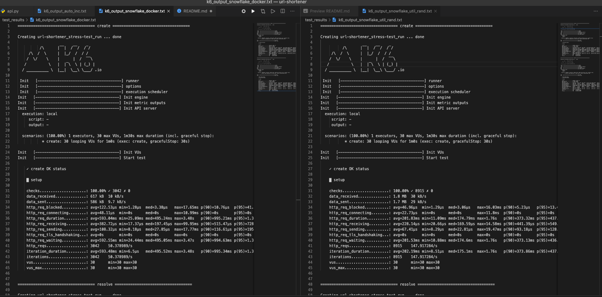

# url-shortener
URL shortener project conducted for "Building a Real-World Scalable Service" Workshop by Shopee

Run:  
```docker-compose build```  
```docker-compose up -d```  
```./db/create-schema.sh```  
```./acceptance-test/run.sh```  

Check that all tests passed.

Permission errors when running shell scripts:  
```find . -type f -iname "*.sh" -exec chmod +x {} \;```

## Summary of updates  

- Set up snowflake generator for short-key generation using existing Docker image (https://hub.docker.com/r/ecarpo/snowflake)



- Set up another endpoint to retrieve all existing db records via GET request



- Set up snowflake generator as an utils package instead. Performed stress-test comparison using k6 against Snowflake Docker option. Snowflake util performs better.



## Learning Points  

### Part 1

After the workshop, the first objective in mind was to replace the auto-increment short-key generator with an implementation of Twitte's Snowflake unique ID generation.

I decided to experiment with running the generator through a Docker service. I managed to find an exising Docker image (https://hub.docker.com/r/ecarpo/snowflake) and spun up a container through `docker-compose`.  

I came to realise that the way to retrieve the unique ID was thru a GET request to `localhost:9000` endpoint URL. I discovered some limitations with Docker on Mac: there is no docker0 bridge on macOS, I cannot ping my containers, and Docker can’t route traffic to containers. To circumvent this, I found out that I could reference `localhost` by declaring `host.docker.internal` instead.  

It worked as a stop-gap measure and I was able to successfully generate unique IDs, which were encoded into strings.  

However, `host.docker.internal` will only work for development purposes, not in a production environment. It also introduced some "inelegance" in the code with the Magic String for the URL. There is definitely room for improvement and it would be good for me to take some time to find out the common practices in dealing with API requests to Docker containers within code.

### Part 2

During Part 1, I have been using MySQL client to query for entries in the `short_url` database. It would be convenient for users to retrieve these results through another API call. It took some time to understand the flow of the application: adding a new URL rule for routing, defining a view function, creating a short_url manager containing a urls_tab_accessor and a short-key generator. I also got to interact with SQLAlchemy's session creation and query methods.

Eventually the endpoint was set up and a JSON response containing all existing entries in the database can be retrieved via API call.

### Part 3

Following up from learning about k6 stress testing in the workshop and setting up Part 1, I had an impression that using different generators may potentially result in differences in system performance (although it may not necessarily be the main bottleneck).  

I figured that I could simply implement a local snowflake generator from an utils package instead of having to set up another Docker service which comes with high overhead. I adapted an existing snowflake id generator (https://github.com/cablehead/python-snowflake/blob/master/snowflake.py).  

With this, we are able to make use of three different generators in `api.py`: auto_inc, Snowflake and SnowflakeUtils.

I ran the same stress test on both snowflake generator approaches. At first, I encountered a problem with the snowflake_utils approach as I was receiving ~5% of check failures in k6 `create` stress test. I found out that this was likely due to unique ID clashes (since so many virtual workers can be spawned at the same timestamp). I resolved this by randomising the worker_id and datacenter_id parameters passed into the snwoflake generator, and also randomly incremented the resultant unique id (although it might not be a foolproof idea, would need to explore on this).  

I'm hoping that I interpreted this correctly, but after multiple runs, it appears that the snowflake_utils approach performed better than the snowflake Docker approach. The request rate was about three times in difference! The performance of the snowflake_utils approach resembled more closely to that of the auto_inc generator previously implemented. Perhaps setting up the Docker service did cause a performance degrade after all?

### Conclusion

Overall, this project has been fun to do and I have managed to learn effectively from this hands-on experience. I am not really experienced with backend implementation, so I am glad that this project has motivated me to get a good broad overview on the various aspects of a real-world, scalable service.

This project is far from completion, and there is indeed many more features I could extend to this url_shortner service! Looking forward to make further developments in this workspace in my free time.
